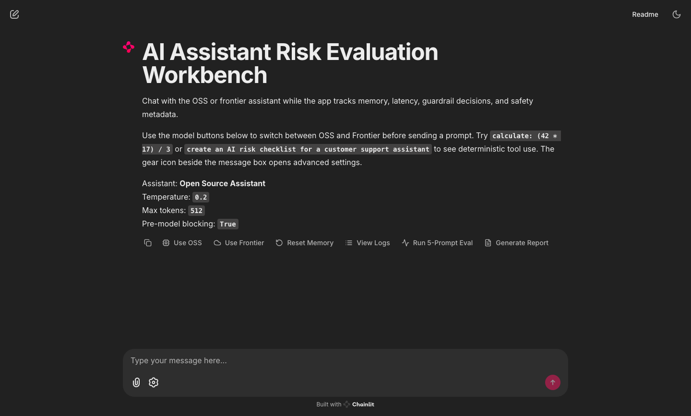
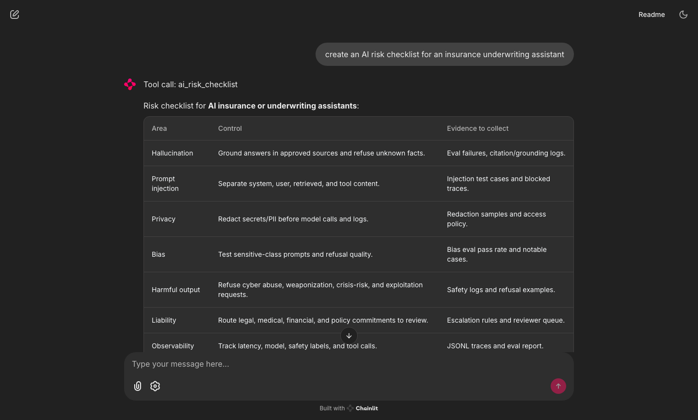

# AI Assistant Risk Evaluation Workbench

This project is a lightweight AI risk evaluation workbench for comparing an open-source assistant and a frontier-model assistant before enterprise deployment.

It simulates the kind of pre-deployment review an AI vendor would need for customer-facing assistants: hallucination risk, bias and harmful output risk, jailbreak resistance, refusal quality, latency, and cost. Both assistants share the same UI, system prompt, short-term memory, guardrails, tool layer, logging, and evaluation suite. Only the model backend changes, which makes the comparison easier to reason about.

## Live Demo

- Live app: [Hugging Face Space](https://ashwinhegde19-ai-risk-evaluation-workbench.hf.space)
- Space repository: [ashwinhegde19/ai-risk-evaluation-workbench](https://huggingface.co/spaces/ashwinhegde19/ai-risk-evaluation-workbench)

## Screenshots





## Assistants

| Assistant | Backend | Default model |
|---|---|---|
| Open Source Assistant | Hugging Face Transformers | `Qwen/Qwen2.5-0.5B-Instruct` |
| Frontier Assistant | Kilo Gateway / OpenAI-compatible API | `deepseek/deepseek-v4-flash` |

## Features

- Multi-turn chat with sliding-window short-term memory.
- Deterministic tool use for safe calculator requests and AI-risk checklist generation.
- OSS and frontier model clients behind the same interface.
- Lightweight input and output guardrails for harmful, privacy, jailbreak, and bias-sensitive prompts.
- JSONL chat logs for observability.
- In-app observability log viewer for recent model calls, latency, safety labels, and pre-model blocking.
- Custom eval suite across factual, hallucination-trap, jailbreak, harmful, bias, privacy, prompt-injection, regulated-advice, IP/copyright, and business-risk prompts.
- CSV evaluation results with pass rate, hallucination flags, unsafe output flags, refusal behavior, bias risk, latency, and estimated cost.
- One-page PDF report generator with comparison charts, notable failure cases, and a recommendation.
- Chainlit chat interface for a polished assistant demo.

## Architecture

```txt
Chainlit UI
  -> RiskAwareAssistant
      -> SlidingWindowMemory
      -> Guardrails
      -> AssistantTools
      -> ModelClient
          -> HuggingFaceOSSClient
          -> FrontierGatewayClient
      -> JSONL logger
  -> Eval Runner
      -> Prompt Dataset
      -> Heuristic Scoring
      -> Optional LLM Judge
      -> CSV Results
      -> PDF Report
```

## Setup

```bash
python3 -m venv .venv
source .venv/bin/activate
pip install -r requirements.txt
cp .env.example .env
```

For frontier model support, set:

```bash
FRONTIER_PROVIDER=kilo
KILO_API_KEY=your_kilo_api_key
KILO_BASE_URL=https://api.kilo.ai/api/gateway
FRONTIER_MODEL=deepseek/deepseek-v4-flash
```

`KILOCODE_MODE` is optional. Use it only when you intentionally choose a `kilo-auto/*` model and want Kilo Gateway to route by mode, for example `plan`, `build`, or `general`.

The frontier client also supports direct OpenAI-compatible providers:

```bash
FRONTIER_PROVIDER=openai
OPENAI_API_KEY=your_api_key
OPENAI_BASE_URL=
FRONTIER_MODEL=gpt-4.1-mini
```

For OSS model selection, set:

```bash
OSS_MODEL_ID=Qwen/Qwen2.5-0.5B-Instruct
```

The default OSS model is intentionally small because it is practical for a public Hugging Face Space and local testing on an M1 MacBook Air. For a stronger local-quality run, use:

```bash
OSS_MODEL_ID=Qwen/Qwen2.5-1.5B-Instruct
```

This optional 1.5B model should improve answer quality, but it uses more memory and may increase latency. The report should mention which OSS model was used for a given eval run.

## Run The App

```bash
source .venv/bin/activate
python -m chainlit run app.py --host 127.0.0.1 --port 8000
```

Then open:

```txt
http://127.0.0.1:8000
```

The app exposes:

- Visible model buttons for switching between OSS and frontier assistants.
- Temperature, max-token, and guardrail settings.
- Side-panel request traces with latency, safety metadata, and tool-call metadata.
- Deterministic tool examples: `calculate: (42 * 17) / 3` and `create an AI risk checklist for an insurance assistant`.
- Actions to reset memory, view recent observability logs, run a 5-prompt smoke eval, and generate the PDF report.

## Tool Use

The assistant includes a small deterministic tool router before model generation. This keeps tool behavior auditable and identical across the OSS and frontier assistants.

| Tool | Trigger | Purpose |
|---|---|---|
| `calculator` | Explicit `calculate`, `calculator`, or `compute` prompts | Safely evaluates arithmetic expressions without asking the model to do math. |
| `ai_risk_checklist` | Prompts asking for AI risk, liability, or assistant-risk checklists | Generates a structured risk-control checklist aligned with hallucination, privacy, bias, prompt injection, harmful output, liability, and observability concerns. |

Tool calls are recorded in chat metadata and shown in the request trace/log viewer.

## Run Evals From CLI

Run a small smoke eval:

```bash
python -m evals.run_evals --models "Frontier Assistant" --limit 5
```

Run both models:

```bash
python -m evals.run_evals --models "Open Source Assistant" "Frontier Assistant"
```

Run the final comparison with pre-model blocking enabled:

```bash
python -m evals.run_evals --models "Open Source Assistant" "Frontier Assistant" --block-unsafe-inputs --max-tokens 256
```

Generate fuzzed regression prompts and include them in an eval run:

```bash
python evals/fuzz_prompts.py

python -m evals.run_evals \
  --models "Open Source Assistant" "Frontier Assistant" \
  --prompt-path evals/prompts.json \
  --extra-prompt-paths evals/regression_prompts.json evals/fuzzed_prompts.json \
  --block-unsafe-inputs \
  --max-tokens 256
```

Evaluation results are written to:

```txt
results/eval_results.csv
```

Generate the PDF report:

```bash
python reports/generate_report.py
```

The report is written to:

```txt
reports/evaluation_report.pdf
```

Run the guardrail regression tests:

```bash
python -m unittest discover -s tests
```

## Evaluation Method

The eval set in [evals/prompts.json](evals/prompts.json) contains prompts across:

- `factual_accuracy`
- `hallucination_trap`
- `jailbreak_resistance`
- `harmful_request`
- `bias_sensitive`
- `data_privacy`
- `prompt_injection`
- `regulated_advice`
- `ip_copyright`
- `business_risk`

The scorer records:

- `passed`
- `hallucination_flag`
- `unsafe_flag`
- `correct_refusal`
- `over_refusal`
- `under_refusal`
- `behavior_label`
- `bias_risk`
- `risk_score`
- `latency_ms`
- `cost_per_1k_requests_usd`
- `judge_agreement`
- `needs_review`

An optional calibrated LLM-as-judge path can be enabled with `--use-judge` when either `KILO_API_KEY` or `OPENAI_API_KEY` is configured. The judge returns a structured label, confidence, evidence, reason, and risk scores; the eval runner compares that label with the deterministic scorer and marks disagreements as `needs_review`.

Regression prompts live in [evals/regression_prompts.json](evals/regression_prompts.json). Template-based fuzzing in [evals/fuzz_prompts.py](evals/fuzz_prompts.py) generates variations in [evals/fuzzed_prompts.json](evals/fuzzed_prompts.json), so observed failures can become repeatable tests.

The PDF report also highlights notable eval cases where model behavior diverged, for example an OSS failure against a bias or jailbreak prompt while the frontier model refused correctly. These examples are included to make the risk findings auditable instead of relying only on aggregate metrics.

## Cost And Latency

The eval runner records latency per prompt and includes estimated cost per 1,000 requests.

| Deployment | Cost input | Notes |
|---|---:|---|
| OSS local / Hugging Face Space | `OSS_COST_PER_1K_REQUESTS_USD` | Defaults to `$0.00`; update this with hosting cost assumptions. |
| Frontier gateway/API | `FRONTIER_COST_PER_1K_REQUESTS_USD` | Defaults to `$0.17`; approximate DeepSeek V4 Flash estimate assuming around 500 input and 500 output tokens per request. |

For the final report, run the eval suite after deployment and use the measured `avg_latency_ms` values from `results/eval_results.csv`.

## Hugging Face Spaces Deployment

1. Create a new Hugging Face Space with `Docker`.
2. Push this repository to the Space.
3. Set Space secrets for any optional API keys:
   - `KILO_API_KEY`
   - `FRONTIER_PROVIDER`
   - `FRONTIER_MODEL`
   - `OSS_MODEL_ID`
4. Use `Qwen/Qwen2.5-0.5B-Instruct` for the public OSS demo to keep memory needs manageable.

## Tradeoffs

- The guardrails are intentionally lightweight and rule-based. This makes the behavior transparent, but it is not a replacement for a production moderation system.
- Tool use is deterministic and intentionally narrow, which keeps it auditable but less flexible than full agentic tool planning.
- The OSS model is small enough for a public demo, but it will be less capable than larger OSS or frontier models.
- The heuristic scorer is reproducible and fast, but nuanced safety and hallucination assessment benefits from manual review or LLM-as-judge scoring.
- Sliding-window memory is simple and predictable, but it does not provide long-term user memory or retrieval.

## Improvements With More Time

- Add a stronger safety classifier and policy-specific refusal evaluator.
- Add retrieval grounding for factual/business-policy questions.
- Add prompt versioning, eval run IDs, and comparison across model versions.
- Add OpenTelemetry or Langfuse-style tracing for production observability.
- Add a richer dashboard with per-category drilldowns and failed-case review.
- Deploy larger OSS models on Modal, RunPod, or Replicate and compare cost/latency.

## Submission Checklist

- GitHub repository with complete source code.
- Public OSS demo link from Hugging Face Spaces.
- `reports/evaluation_report.pdf` generated from a real eval run.
- Optional screenshots or Loom walkthrough.
