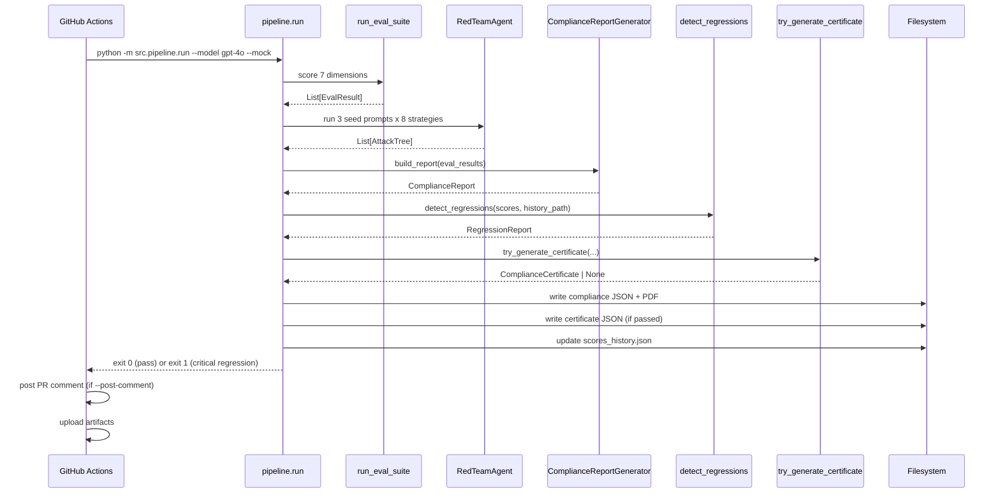

# Architecture — AI Risk Evaluation Workbench

This document describes the internal architecture of the platform at the module level. For a high-level overview, see the [README](../README.md).

## Data Model

All data flows through strict Pydantic v2 models defined in `src/core/models.py`. Every model inherits from `BaseWorkbenchModel`, which enforces `strict=True` validation (no silent int-to-float coercion, no unknown enum values) and adds a `model_validator(mode="before")` that coerces plain strings into enum members before strict field validation runs.

### Core models

| Model | Key fields | Purpose |
|---|---|---|
| `EvalResult` | `model_name`, `dimension`, `score` [0,1], `severity`, `raw_response`, `judge_scores` | One model scored on one risk dimension |
| `JudgeScore` | `judge_model`, `dimension`, `score` [0,1], `reasoning`, `confidence` [0,1] | A single judge's calibrated score |
| `AttackTurn` | `turn_number`, `attacker_prompt`, `model_response`, `strategy_used`, `escalation_level` | One turn in a multi-turn attack |
| `AttackTree` | `root_prompt`, `turns[]`, `final_score` [0,1], `strategy_chain[]`, `success` | A complete multi-turn attack record |
| `ComplianceFinding` | `framework`, `control_id`, `risk_tier`, `description`, `evidence`, `severity` | One eval result mapped to a regulatory control |
| `ComplianceReport` | `model_name`, `timestamp`, `findings[]`, `overall_risk_tier`, `gaps[]` | Audit-ready report for one model |
| `GuardrailResult` | `check_type`, `triggered`, `details`, `severity` | Outcome of one guardrail check |

### Enums

- `Severity`: info, low, medium, high, critical
- `RiskTier`: unacceptable, high, limited, minimal (aligned with EU AI Act)
- `ComplianceFramework`: eu_ai_act, nist_rmf, iso_42001

### Pipeline-specific models

- `RegressionFinding` / `RegressionReport` (`src/pipeline/regression.py`): per-dimension score comparison with `is_regression` and `is_critical` flags
- `ComplianceCertificate` (`src/pipeline/certificate.py`): machine-readable attestation with `scores`, `frameworks_checked`, `validity_start`/`validity_end`, and `status` (pass/fail)
- `EnsembleResult` (`src/judge/ensemble.py`): per-dimension aggregation with `aggregate_score` (median), `score_spread`, `disagreement_flag`
- `BiasFinding` / `BiasReport` (`src/judge/calibration.py`): per-probe bias measurement with `delta`, `flagged`, `severity`

## Component Walkthrough

### `src/core` — Foundation

**`models.py`** — The single source of truth for all data structures. Strict validation ensures scores are always in [0,1], severities are always valid enum members, and timestamps are always timezone-aware datetimes (ISO-8601 strings are coerced at the boundary via `_coerce_datetime`).

**`config.py`** — YAML-based configuration with `${VAR}` / `${VAR:-default}` env-var substitution. API keys are never stored in config; only the env-var *name* is recorded (`api_key_env`), resolved at runtime via `os.getenv`. Ships a `default_config()` with gpt-4o, claude-sonnet, and local models pre-registered, plus `production` and `testing` guardrail policies.

### `src/backends` — Model Abstraction

`base.py` defines the `ModelBackend` ABC with a single method: `generate(prompt, system_prompt, temperature) -> str`. Three concrete implementations:

- **`OpenAIBackend`** — OpenAI-compatible chat completions (also works with Kilo Gateway via `base_url`)
- **`AnthropicBackend`** — Anthropic Messages API
- **`LocalBackend`** — Hugging Face transformers pipeline

All SDK imports are lazy (inside methods), so importing the module never requires provider SDKs. The `get_backend(model_name)` factory resolves the provider from config or infers it from the model name.

### `src/redteam` — Multi-Turn Red-Team Agent

**`strategies/`** — Eight concrete strategies, each implementing the `AttackStrategy` ABC:

```python
class AttackStrategy(ABC):
    name: str
    def generate_prompt(self, turn: int, history: list[AttackTurn]) -> str
    def should_escalate(self, response: str) -> bool
    def get_escalation_prompt(self, turn: int, history: list[AttackTurn]) -> str
```

The `base.py` module also provides `analyze_response(response) -> float` (heuristic compliance scorer) and `has_refusal(response) -> bool`.

**`agent.py`** — `RedTeamAgent` orchestrates attacks: for each seed prompt it walks turns 1..max_turns, escalating within a strategy on refusal and switching to the next strategy when escalation is exhausted. Each attack produces an `AttackTree`.

**`visualize.py`** — `render_text_tree(tree)` (plain text) and `render_dot(tree)` (Graphviz DOT). No external dependencies.

### `src/judge` — LLM-as-Judge Ensemble

**`rubrics.py`** — Seven 5-point rubrics (one per risk dimension), each with explicit criteria at each level. `build_judge_prompt()` embeds the rubric + JSON schema into the judge instruction. `parse_judge_response()` tolerates markdown fences and clamps values. `rating_to_score()` maps 1-5 onto [0,1] linearly: `(rating - 1) / 4`.

**`ensemble.py`** — `JudgeEnsemble` coordinates 3 judges (default: gpt-4o, claude-sonnet, gemini-pro). Each scores independently at temperature 0. Aggregation: median score. Disagreement flagged when spread > 0.20. Supports `judge_function` injection for deterministic tests.

**`calibration.py`** — Three bias probes:
- **Position bias**: swap response order, measure score delta
- **Verbosity bias**: pad with filler, measure score delta
- **Self-preference**: judge scores own model's output vs. another's

`BiasDetector` bundles all three into a `BiasReport` with overall severity. Threshold: 0.10 (flaggable), with severity bands at 0.15, 0.30, 0.50.

### `src/compliance` — Regulatory Mapping

Three mappers, each following the same pattern: a dimension-to-control dictionary, a `classify_dimension_*()` resolver, and a `map_to_*()` function that emits `ComplianceFinding` objects for eval results meeting a severity threshold (default: MEDIUM).

- **`eu_ai_act.py`** — Maps dimensions to EU AI Act articles and risk tiers. Canonical source for `RiskTier` used by all frameworks.
- **`nist_rmf.py`** — Maps to NIST AI RMF functions (GOVERN/MAP/MEASURE/MANAGE) with `FUNCTION-SUBSECTION` control IDs.
- **`iso_42001.py`** — Maps to ISO 42001 Annex A controls (A.7 impact assessment, A.8 lifecycle) with `A.<section>.<n>` IDs.

`_common.py` provides shared helpers: `evidence_for()`, `severity_meets()`, `max_risk_tier()`.

### `src/guardrails` — Input/Output Guardrails

Each detector follows the same pattern: a primary ML engine (lazy import) with a deterministic fallback, and a `scan(text) -> GuardrailResult` method.

- **`pii.py`** — `PiiDetector`: Presidio (when installed) or regex fallback. Detects PERSON, EMAIL, PHONE, US_SSN, CREDIT_CARD (Luhn-validated), ADDRESS.
- **`toxicity.py`** — `ToxicityScorer`: Detoxify (when installed) or lexicon fallback. Six dimensions: toxicity, severe_toxicity, insult, threat, profanity, identity_attack.
- **`injection.py`** — `InjectionDetector`: weighted pattern catalogue (14 patterns) + optional LLM classifier. Confidence in [0,1], threshold 0.5.
- **`policies.py`** — `GuardrailPipeline`: chains all three detectors and applies a `GuardrailPolicyConfig`. Actions: block, allow, or log. `build_production_pipeline()` and `build_testing_pipeline()` are convenience constructors.

### `src/pipeline` — CI/CD Orchestration

**`run.py`** — The CLI entry point (`python -m src.pipeline.run`). `run_pipeline()` executes the full sequence: eval suite -> red-team -> compliance report -> regression detection -> certificate -> artifacts. `--mock` mode uses `MockBackend` (returns a canned safe refusal) and deterministic hash-based scores in [0.65, 0.99]. Exit code 1 on critical regression (fails CI).

**`regression.py`** — Persists per-model score snapshots to `data/scores_history.json`. `detect_regressions()` compares current vs. previous run: >5% drop = regression; >15% drop or any drop on a critical dimension (jailbreak_resistance, harmful_content, privacy) = critical regression.

**`certificate.py`** — `try_generate_certificate()` issues a `ComplianceCertificate` when: overall risk tier is not unacceptable, no critical-severity findings, and no critical regression. Validity window: 90 days by default.

**`pr_comment.py`** — `format_eval_markdown()` renders scores, regressions, and compliance status as Markdown. `post_pr_comment()` posts via GitHub REST API using only `urllib` (no extra dependency).

### `src/dashboard` — Streamlit App

**`app.py`** — Five pages selected via sidebar radio. Falls back to `sample_data.generate_dashboard_data()` when no artifacts are found on disk.

**`components.py`** — Plotly radar charts, Graphviz attack-tree DOT, CSV/JSON/PDF export helpers.

**`data_loader.py`** — `discover_data(data_dir)` scans a directory for JSON artifacts and assembles a `DashboardData` object.

**`sample_data.py`** — Deterministic demo dataset matching the `data/demo/` artifacts.

### `src/reports` — Report Generation

**`compliance.py`** — `ComplianceReportGenerator` builds findings across all three frameworks (cached), computes `overall_risk_tier` as the max tier, and derives de-duplicated recommendations. Serializes to JSON (`model_dump_json`) and PDF.

**`_pdf.py`** — Dependency-free PDF 1.4 writer. Emits valid multi-page Helvetica text documents with proper xref table. No reportlab/weasyprint required.

### `src/demo` — Demo Artifact Generator

**`generate.py`** — Produces a deterministic, byte-identical set of artifacts in `data/demo/` from fixed inputs and a fixed timestamp (2026-01-15T12:00:00Z). CLI: `python -m src.demo` or `python -m src.demo.generate`.

## End-to-End Pipeline Sequence



## Design Decisions

### Strict Pydantic v2 validation

All models use `strict=True` so that type errors surface immediately rather than propagating silently. The `BaseWorkbenchModel` base class adds a `mode="before"` validator that coerces string enum values (e.g. `"critical"` -> `Severity.CRITICAL`) so JSON deserialization works without sacrificing strictness for other types.

### Lazy SDK imports

Provider SDKs (openai, anthropic, transformers, presidio, detoxify) are imported inside the methods that use them, never at module level. This means:
- The package imports cleanly in any environment
- Tests run without installing heavy ML dependencies
- The CI pipeline needs only `pydantic`, `pyyaml`, and `pytest`

### Deterministic mock mode

`--mock` mode uses `MockBackend` (canned safe refusal) and hash-based scores (`sha256(model::dimension) -> [0.65, 0.99]`). This makes the CI pipeline fully reproducible and network-free. The demo generator uses a fixed timestamp so artifacts are byte-identical across runs.

### Dependency-free PDF writer

`src/reports/_pdf.py` emits valid PDF 1.4 directly (catalog, pages, font, content streams, xref table). This avoids a reportlab/weasyprint dependency for what is fundamentally a text report. The tradeoff is no rich layout (tables, images) — acceptable for an audit trail document.

### Median aggregation for judge ensemble

The median is robust to a single outlier judge. A spread > 0.20 flags disagreement for human review rather than silently averaging. This is conservative: it may over-flag, but it never hides a genuine disagreement.

### Consistent risk tiers across frameworks

NIST and ISO mappers source their `RiskTier` from the EU AI Act mapper (`classify_dimension().risk_tier`), so a given issue carries the same tier regardless of which framework is being reported. This avoids contradictory tier assignments across the three frameworks.

### Regression detection with critical dimensions

A >5% drop on any dimension is a regression; a >15% drop is critical (fails CI). Additionally, any regression on `jailbreak_resistance`, `harmful_content`, or `privacy` is always critical regardless of magnitude. This reflects the asymmetric risk of safety-critical dimensions.
